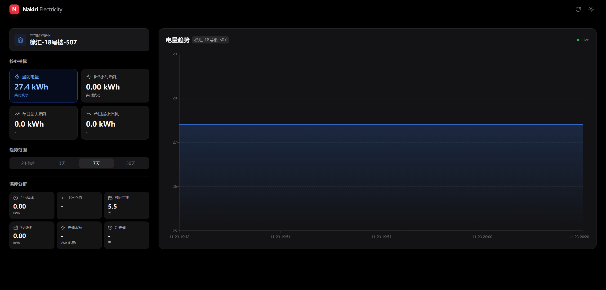
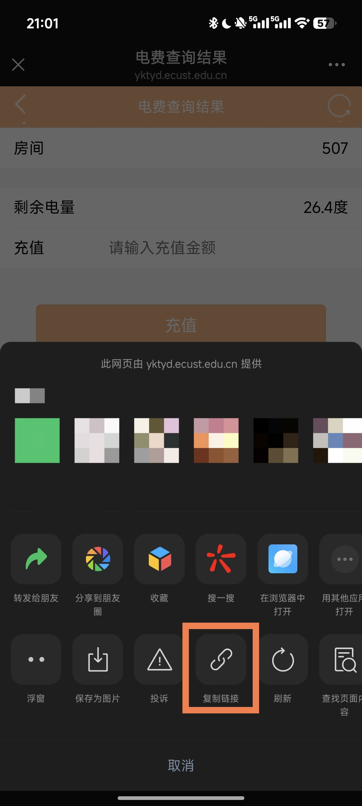

# Nakiri Electricity Docker

Nakiri Electricity 是一个现代化、高颜值的宿舍电量监控面板。

它可以帮助你实时追踪特定房间的电力消耗情况，提供详细的图表分析、充值记录检测以及剩余可用天数估算。项目采用前后端分离架构（SERN Stack），并针对 Docker 部署进行了深度优化。



✨ 功能特性

📊 深度数据分析：

实时电量趋势图（支持平滑曲线与数据点交互）。

核心指标看板：当前余量、近3小时消耗、单日最大/最小消耗。

深度分析：24小时消耗、7天消耗、上次充值金额及时间、预计可用天数估算。

🎨 现代化 UI 设计：

基于 Tailwind CSS 的响应式布局，完美适配桌面与移动端。

原生支持 深色模式 (Dark Mode)，随系统自动切换或手动切换。

丝滑的 Framer Motion 交互动画。

🐳 Docker 容器化：

支持通过环境变量 (ENV) 动态配置监控房间、楼栋信息和抓取地址。

数据持久化支持 (SQLite)。

多阶段构建，镜像体积小巧。

🤖 自动化运行：

后端内置 Cron 定时任务，每小时自动抓取最新数据。

智能识别充值行为（排除充值带来的电量跳变干扰消耗计算）。

🛠️ 技术栈

前端: React 18, Vite, Tailwind CSS, Recharts, Framer Motion, Lucide React

后端: Node.js, Express, Axios, Node-cron

数据库: SQLite3

## 部署方式: Docker

🚀 Docker 部署

这是最简单的部署方式。无需安装 Node.js 环境，只需 Docker 即可。

### 1. 拉取镜像（可选）

使用命令从 Docker Hub 上拉取：
```
docker pull nakiripolaris/nakiri-electricity:latest
```

### 2. 运行容器

使用 docker run 启动服务。你需要通过 -e 参数传入房间配置。

#### 完整配置：
**你需要修改4个环境变量，替换成你自己的信息**
```
docker run -d \
  --name nakiri-electricity \
  -p 这里替换成你的本机端口:8080 \ #（如：-p 8080:8080）（必填）
  -v 文件路径:/app/data \ #（如：-v $(pwd)/data:/app/data \）（用来存放数据库文件）（必填）
  -e PART_ID=校区编号 \ #（如：-e PART_ID=0）（0：代表奉贤校区 | 1：代表徐汇校区）
  -e BUILD_ID=楼号 \ #（如：-e BUILD_ID=1）
  -e ROOM_ID=房间号 \ #（如：-e ROOM_ID=101）（必填）
  -e ROOM_URL="替换成获取的URL链接（获取方式最下面有）" \ #（如：-e ROOM_URL="https://yktyd.ecust.edu.cn/epay/wxpage/wanxiao/eleresult?sysid=1&roomid=101&areaid=2&buildid=1"）（必填）
  nakiripolaris/nakiri-electricity:latest
```
##### 访问地址: http://你机器的IP:你设置的端口

#### 示例配置：
奉贤校区，1号楼1层，101号宿舍：
```
docker run -d \
  --name nakiri-electricity \
  -p 8080:8080 \
  -v $(pwd)/data:/app/data \
  -e PART_ID=0 \
  -e BUILD_ID=1 \
  -e ROOM_ID=101 \
  -e ROOM_URL="https://yktyd.ecust.edu.cn/epay/wxpage/wanxiao/eleresult?sysid=1&roomid=101&areaid=2&buildid=1" \
  nakiripolaris/nakiri-electricity:latest
```

##### 访问地址: http://localhost:8080

### 3、高级配置：构建镜像

如果你使用的是非AMD64架构的系统，或运行时报错，可在项目根目录下运行：

docker build -t nakiri-electricity .

📂 项目结构  
.  
├── src/                # React 前端源码  
│   ├── App.jsx         # 主应用逻辑 (UI, 数据计算, 图表)  
│   ├── main.jsx        # 入口文件  
│   └── index.css       # Tailwind 样式配置  
├── dist/               # 构建后的静态文件 (由 npm run build 生成)  
├── data/               # 数据库存储目录  
├── server.js           # Express 后端入口 & API 定义  
├── scraper.js          # 爬虫逻辑 (Axios)  
├── database.js         # SQLite 数据库连接与初始化  
├── Dockerfile          # Docker 构建文件  
├── package.json        # 项目依赖配置  
├── vite.config.js      # Vite 配置 (含 API 代理)  
└── tailwind.config.js  # Tailwind 配置  

## URL获取方式：
去你充值电费的页面：信息办公众号（华理信管中心）- 微门户 - 电费充值 - 选择你的房间 - 进到充值界面（如图）
右上角三个点，复制链接（复制的就是需要的URL）
<p align="center">
  
</p>  

## Nginx反向代理：
示例配置：
```
server {
  listen 443 ssl;
  listen [::]:443 ssl;
  server_name URL; #替换成你的域名
  
  ssl_certificate       /etc/nginx/ssl/URL.cer; #证书位置
  ssl_certificate_key   /etc/nginx/ssl/URL.key; #私钥位置
  
  ssl_session_timeout 1d;
  ssl_session_cache shared:MozSSL:10m;
  ssl_session_tickets off;
  ssl_protocols    TLSv1.2 TLSv1.3;
  ssl_prefer_server_ciphers off;
  
  location / {
    proxy_pass http://IP:PORT; #替换成你的IP和端口（如：http://192.168.1.2:8080）
    proxy_set_header Host $host;
    proxy_set_header X-Real-IP $remote_addr;
    proxy_set_header X-Forwarded-For $proxy_add_x_forwarded_for;
    proxy_set_header X-Forwarded-Proto $scheme;
  }
}
```

📄 License

MIT License
